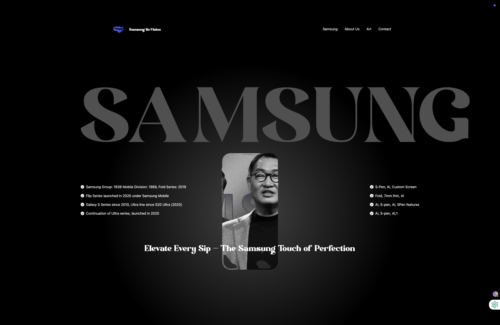

# Capture Moments
# Samsung Re:Vision 🚀

##  Screenshots

###  Home Section

###  Creator Voices

### Creator Voices

### ✨ GSAP Animation Example

**GSAP ALL USES**
# cmd to install in react :
# npm install gsap @gsap/react

# useGSAP () -> is similar to UseEffect();
# useGSAP (() => {

# },[])

## GsapTo
## Gsap.to() is used to animate ele from **current state** to **new state**
# It is Similar to Gsap.from() - animate **new state** to **current State**

- **Gsap.to(ele, {rotation, x, duration})**

# GSAP TIMELINE

## gsap.timeline() method is used to create timeline instance that can be used to manage multiple animations

# It is similar to gsap.to(), gsap.from(), gsap.fromTo() but difference that the gsap.timeline() method is used to create timeline instance that can be manage mutiple animations, while gsap.to(), gsap.from(), gsap.fromTo() method is used **to** animate the element from the current state to new state and **from** new state current state

# var tl = gsap.timeline({**repeat, delay**})

# GsapStagger : 

## GSAP stagger is a feature that allow you to apply animation with a ==stagger delay== to a group of element

# GsapScroll Trigger

**GsapScroll() Trigger is a plugin that allow you to create animation that are triggered by scrolling position the page**

## npm install gsap @gsap/react react-responsive

**Install tailwind CSS**
# npm install tailwindcss @tailwindcss/vite

## FFmpeg -> this help to keep frames of Video Smooth in sm devices

# cmd -> **ffmpeg -i input.mp4 -vf scale=960:-1 -movflags faststart -vcodec libx264 -crf 20 -g 1 -pix_fmt yuv420p output.mp4**# Samsung-Re-Vision
# Samsung-Re-Vision
